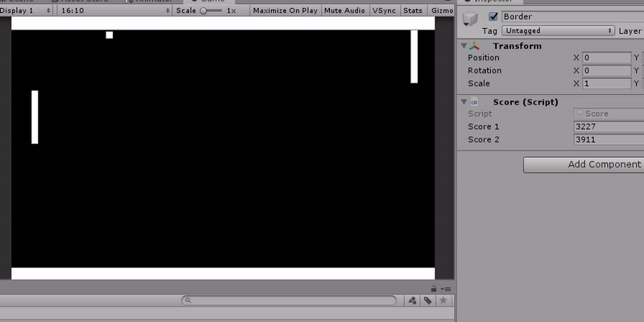
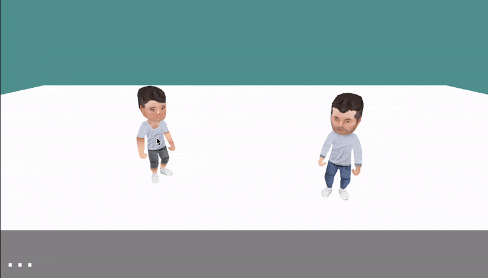

# 🧬 Unity ML Lab

**Machine learning experiments in Unity — each folder is a self-contained project with its own README.**

Most of these lived as standalone repos; they were merged here to keep the Unity + AI experiments in one place.

| Preview | Experiment | Description |
|:---:|---|---|
|  | **[imitation-learning](imitation-learning)** | Record the game state and the player's actions, then train a neural network to imitate them |
| | **[genetic-algorithms](genetic-algorithms)** | Three genetic algorithms: function minimization, the Travelling Salesman Problem and more |
|  | **[pong-policy-gradients](pong-policy-gradients)** | Policy gradients (reinforcement learning) applied to Pong, with neural network and softmax approaches |
| | **[dlf-reinforcement-learning](dlf-reinforcement-learning)** | Reinforcement learning in Unity using [DLF/TAS](https://github.com/HectorPulido/Machine-learning-Framework-Csharp), the from-scratch autograd framework |
|  | **[llama2-binding](llama2-binding)** | Connect Unity with the Llama 2 LLM through Python websockets — client/server, useful for games |

## 🚀 Related repos (kept separate)

[Evolutionary-Neural-Networks-on-unity-for-bots](https://github.com/HectorPulido/Evolutionary-Neural-Networks-on-unity-for-bots) — neural networks + genetic algorithms in Unity, with a full Survival Shooter example ·
[Machine-learning-Framework-Csharp](https://github.com/HectorPulido/Machine-learning-Framework-Csharp) — TAS autograd framework + SimpleLinearAlgebra ·
[AwesomeUnityProjects](https://github.com/HectorPulido/AwesomeUnityProjects) — 38 games and systems made with Unity

<h3 align="center">Let's connect 😋</h3>

 &nbsp; &nbsp;
 &nbsp; &nbsp;
 &nbsp; &nbsp;

